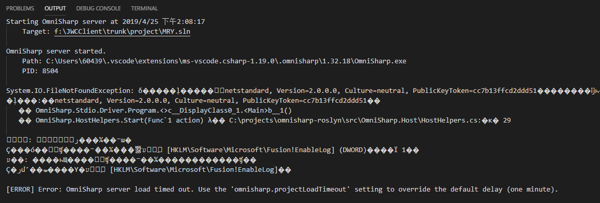
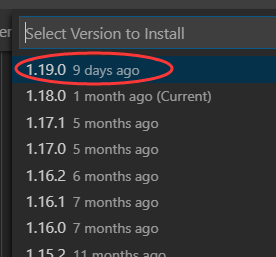
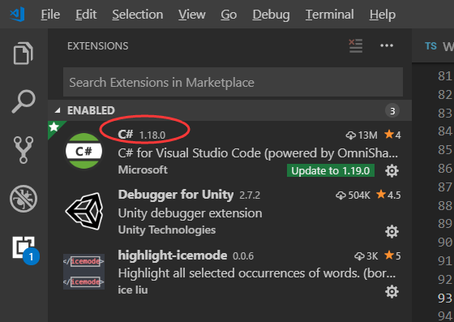

# Others

## Omnisharp stop working in vs code suddenly.

要在vs code上写C#，需要安装Omnisharp C#插件。它可以提供代码提示、导航、引用计数等实用功能，体验很棒。前几天突然发现插件失灵了，代码提示没了，导航功能也失效了，引用计数也没有了，只能重新启用visual studio来写C#。

下图是启动vs code后的Output日志截图。

> 原因：vs code会自动升级插件，最新的Omnisharp插件有问题。解决方法如下：
> * 关闭自动升级插件功能，Ctrl+shift+P调出vs code命令行，输入auto update...，选择命令Extensions: Disable Auto Updating Extensions
> * 点击Omnisharp插件上的齿轮图标，然后点击Install Another Version，选择安装上一个版本
> * 点击插件上的reload required重启vs code即可

---

