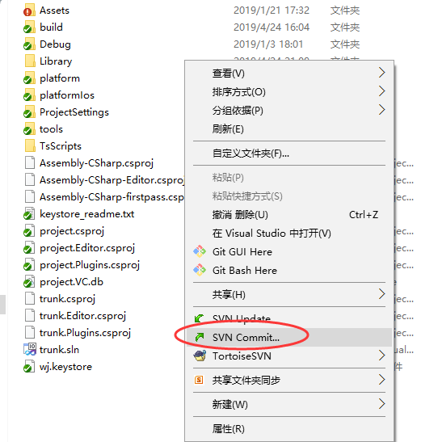
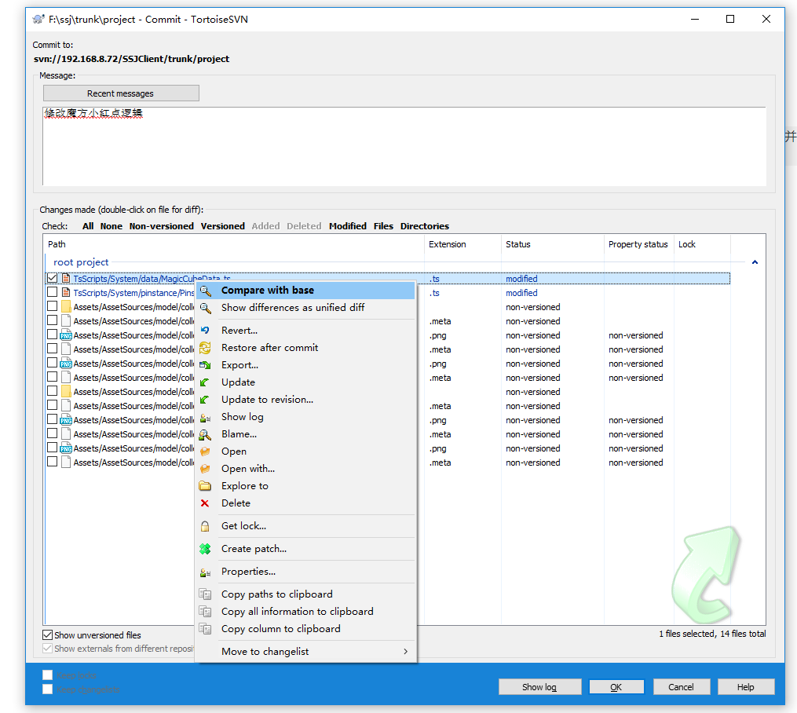
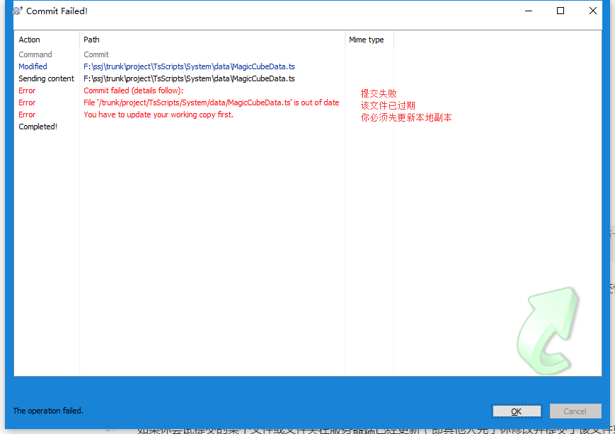
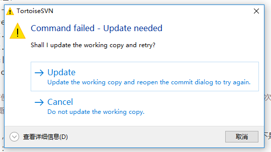

# 提交(commit)

右键->Svn Commit

在提交界面，可以选中某个文件点击右键展开右键菜单，包含以下常用操作：

|操作|用途|
|:---|:---|
|Compare with base|查看指定文件和前次版本的修改记录|
|Revert...|撤销指定文件的所有修改|
|Export...|导出选中文件至...|
|Update|更新指定文件|
|Show log|查看该文件的日志记录|

> 为了方便后续的合并操作，提交时应遵守“一次一主题，分主题提交”的原则。即每次提交仅与一个修改主题相关，不要将多个不同主题的修改同时提交。

举个例子，为了实现需求A，你修改了文件a；为了实现需求B，你修改了文件b。以下是2种提交情形的对比：

|提交情形|后续回滚需求|后续合并到其它版本|
|:---|:---|:---|
|同时提交a和b|只能同时回滚需求A和B|只能同时合并需求A和B|
|分两次分别提交a和b|支持单独回滚需求A和B|支持单独合并需求A和B|

如果你尝试提交的某个文件或文件夹在服务器端已经更新（即其他人先于你修改并提交了该文件或文件夹），则会发生提交失败，如下图所示：

此时，点击OK将弹出对话框询问是否更新，如下图所示。在绝大多数情况下，请选择Update更新后再继续提交。更新可能会发生冲突，详见[冲突(conflict)](//conflict.md)

