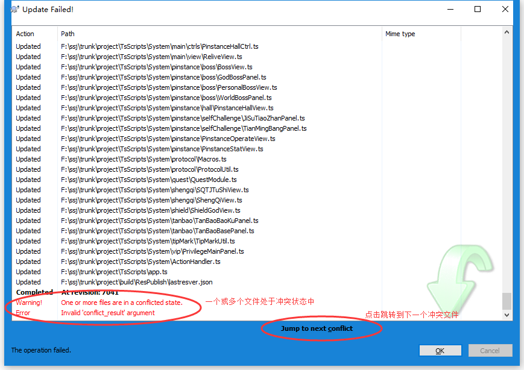
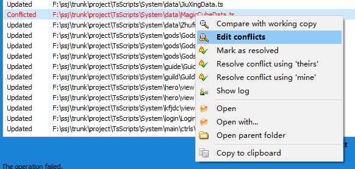
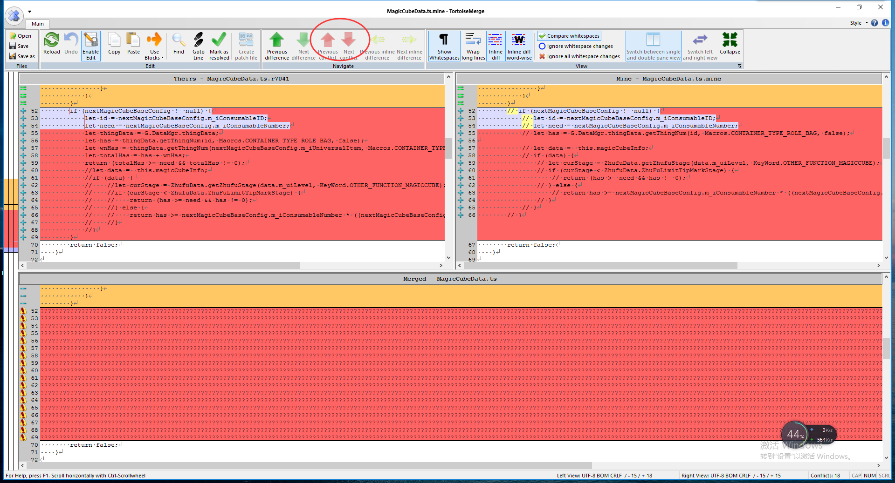
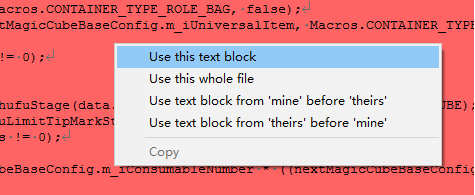
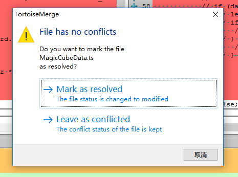

# 冲突(conflict)

冲突通常发生在对本地副本进行更新时。当两个人同时对同一个文本文件的同一个位置进行了不同的修改，或者对同一个二进制文件进行修改之后，往往会发生冲突。通常需要对冲突进行编辑，并标记为解决，才可以进行下一步的操作。

在冲突文件的右键菜单上，包含以下常用操作：

|操作|用途|
|:---|:---|
|Edit conflicts|编辑冲突|
|Mark as resolved|标记为已解决状态|
|Resolve conflict using 'theirs'|使用服务器上的版本以解决冲突|
|Resolve conflict using 'mine'|使用本地版本以解决冲突|
|Show log|查看该文件的日志记录|

## 编辑冲突

整个窗口分为菜单栏、Theirs栏、Mine栏和Merged预览4个部分。

菜单栏的主要操作是红框中的冲突跳转按钮，方便跳转到各个冲突部位进行编辑。

Theirs栏展示了服务器端文件的修改明细，Mine栏展示了本地副本文件的修改明细。在冲突块的右键菜单上包含以下常用操作：

|操作|用途|
|:---|:---|
|Use this text block|使用本侧的文本块|
|Use this whole file|使用本侧的整个文件|
|Use text block from 'mine' before 'theirs'|保留两侧的文本块，本地的修改在前，服务器的在后|
|Use text block from 'theirs' before 'mine'|保留两侧的文本块，服务器的在前，本地的修改在后|

下方的Merged栏可实时预览合并后的效果。

当鼠标定位在非冲突块中，若此时跳转冲突的红色箭头按钮均不可点击，则说明这个文件的所有冲突均已解决。此时按下Ctrl+S进行保存，会弹出如下对话框，提示是否标记为已解决，点击Mark as resolved即可。
