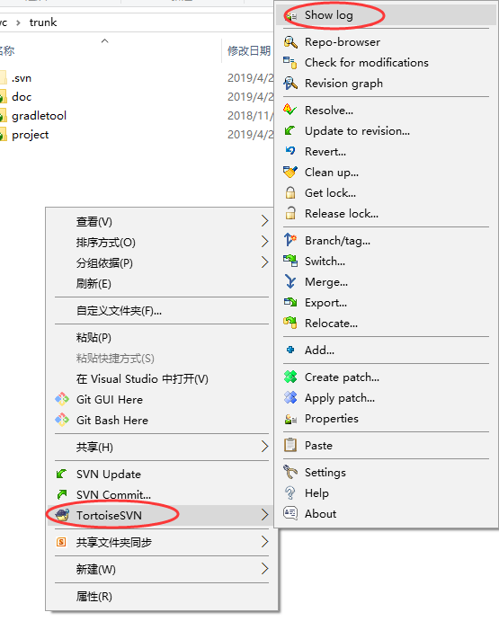
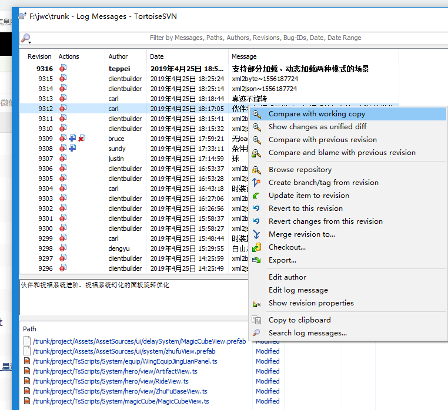
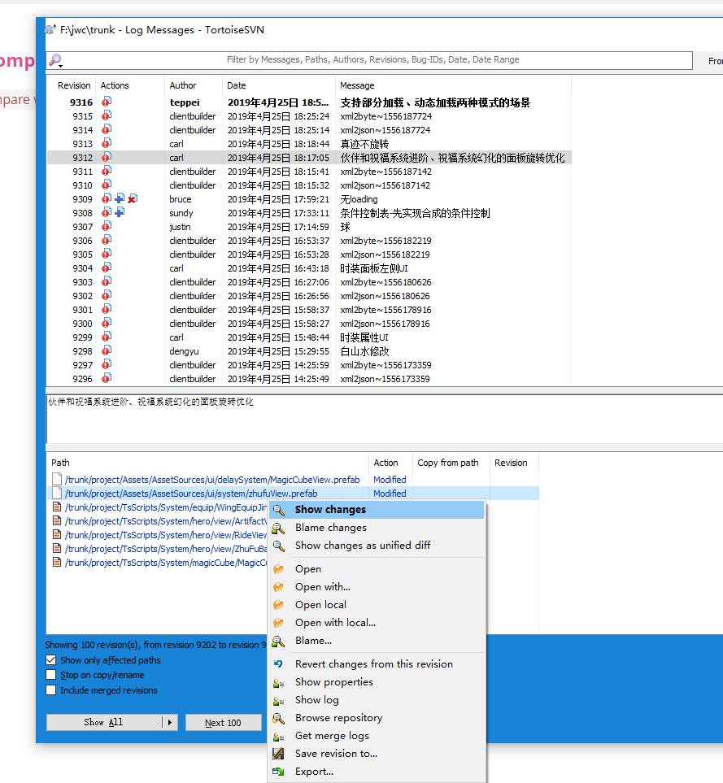

# 查看(info)

右键 -> TortoiseSVN -> Show log

在日志记录中可以查看每次版本的修改人、提交时间、备注、相关文件及状态。

在版本记录的右键菜单中，包含以下常用操作：

|操作|用途|
|:---|:---|
|Compare with working copy|将本地副本和指定版本进行差异对比|
|Compare with previous revision|将指定版本和其前次版本进行差异对比|
|Revert to this revision|将本地副本回滚至指定版本|
|Revert changes from this revision|回滚指定版本的修改|
|Merge resivion to...|将指定版本的修改合并到...|
|Edit log message|修改备注信息|

在相关文件的右键菜单中，包含以下常用操作：

|操作|用途|
|:---|:---|
|Show changes|查看指定文件该次版本的修改详情|
|Compare with previous revision|将指定版本和其前次版本进行差异对比|
|Revert to this revision|将本地副本回滚至指定版本|
|Revert changes from this revision|回滚指定版本的修改|
|Merge resivion to|合并至指定版本|
|Edit log message|修改备注信息|
|Save revision to...|保存选中文件的指定版本至...|
|Export...|导出选中文件的指定版本至...，会保留文件的路径目录|
