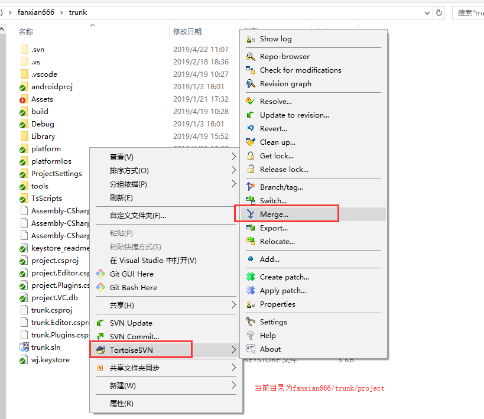
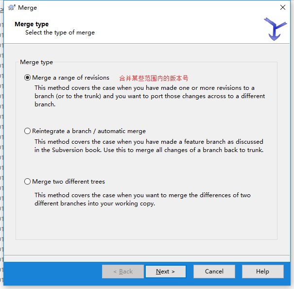
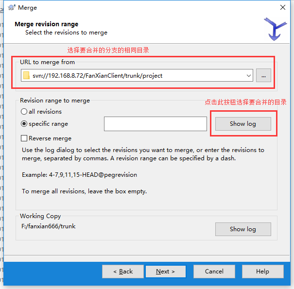
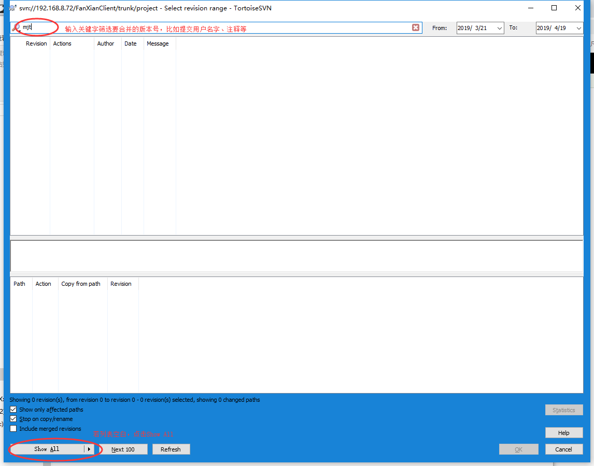
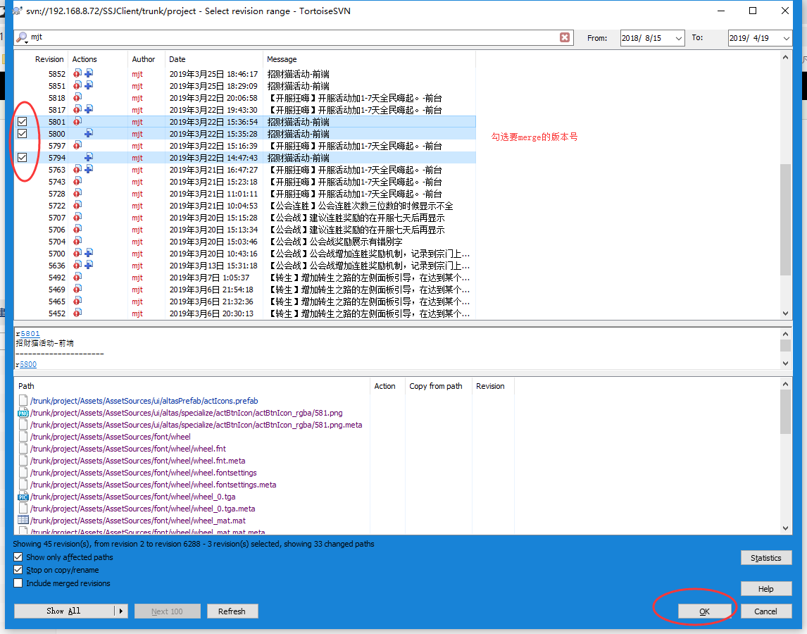
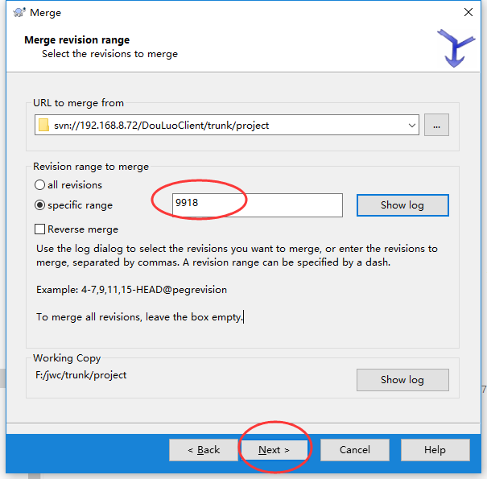
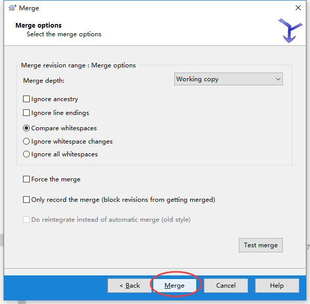
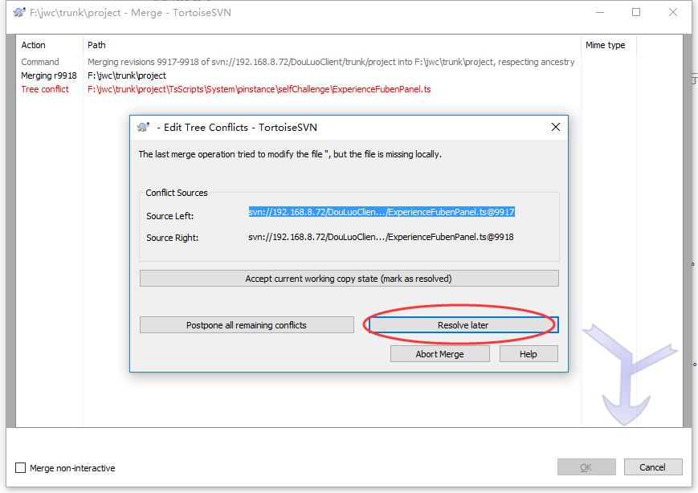

# 合并(merge)

我们经常会在不同项目之间同步需求，此时利用SVN的merge功能可以极大地提高效率。

## Step 1
右键->TortoiseSVN->Merge...

> 通常我们在项目根目录上进行合并操作。对于客户端项目来说，应该在project目录级别上进行merge。

## step 2
在接下来弹出的对话框上选择Merge a range of revisions

## step 3
在接下来弹出的对话框上：
* URL to merge from 输入合并来源的SVN地址，需要注意目录层级和合并目的的目录层级一致。
* specific range 点击Show log选择要合并的版本次

## step 4
在接下来弹出的对话框上将显示来源目录的日志记录，可以通过关键字筛选出需要合并的版本次。
日志记录默认仅展示最近的100条记录，可以点击Show All展示所有记录。

在版本次前面的小方框上打勾，点击Ok按钮。

继续点击Next按钮。

继续点击Merge按钮。

## step 5
由于不同项目之间的差异，合并的时候往往会发生冲突。当合并某个版本次发生冲突时，SVN会终止合并。此时应该点击Resolve later编辑冲突，然后重新选择后续的版本次继续合并。

> 需要注意的是，合并操作发生在本地副本中，因此合并完成后需要提交到服务器。