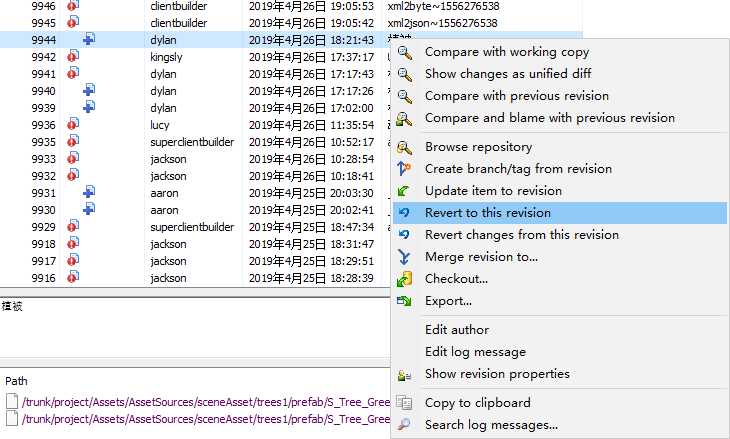
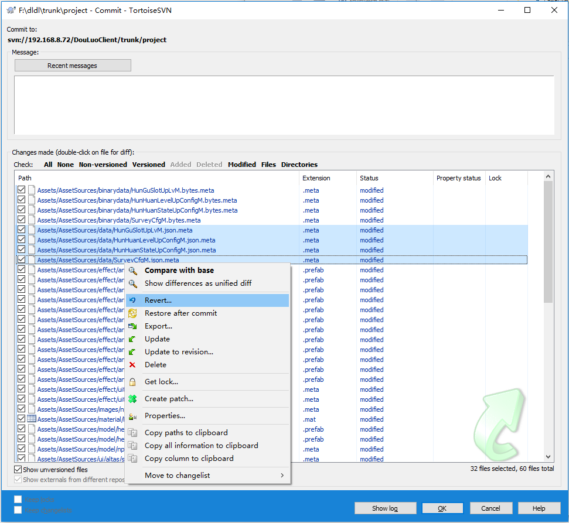

# 回滚(revert)

回滚，即将某个版本次的修改撤销掉，相当于Ctrl+Z。我们通常所说的回滚，包括两种情形：
* 回滚已提交的历史版本次
* 回滚本地副本未提交的修改

## 回滚已提交的历史版本次

在查看日志记录界面上，选中一个或者多个版本次，点击右键，在右键菜单中与回滚相关的两个选项可供选择。

|回滚操作|说明|
|:---|:---|
|Revert to this revision|撤销指定版本次及其往后所有版本次的修改记录|
|Revert changes from this revision|仅撤销指定版本次的修改记录|

> 进行Revert操作时，尽量保持本地副本没有尚未提交的修改。因为Revert本身也是对本地副本文件的一种“反向修改”，可能会导致冲突发生。

> Revert changes from this revision 比 Revert to this revision 更容易发生冲突。因为当次修改涉及的文件可能在往后的版本次中也发生了修改。关于编辑冲突，详见[conflict](//conflict.md)。

## 回滚本地副本未提及的修改

在提交界面上，选中一个或者多个文件，点击右键菜单上的Revert选项即可撤销所选文件的修改。

