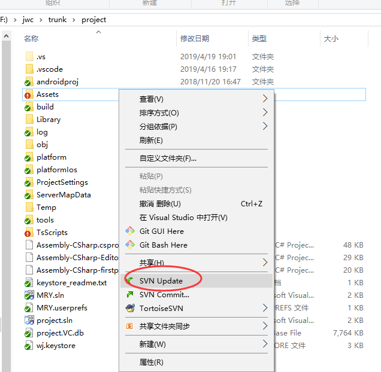
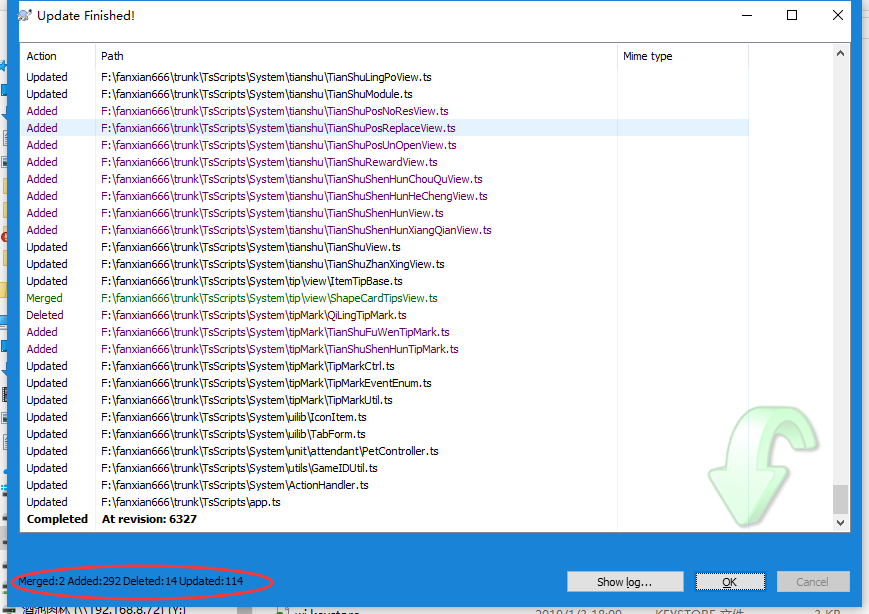

# 更新(update)

右键->更新

如上图所示，红框中可以看到本次更新的统计信息。以下是几种常见状态的说明：
|状态|说明|备注|
|:---|:---|:---|
|Updated|该文件发生了更新|该文件本地副本没有修改，而服务器上已被修改|
|Added|该文件为新增文件|更新之前本地副本中不存在该文件|
|Deleted|该文件已被删除|更新之前本地副本中存在该文件|
|Merged|该文件已被成功合并|本地副本和服务器上的均存在修改记录，且没有冲突|
|Conflict|该文件发生了冲突|本地副本的修改和服务器上的修改存在冲突，需要解决|

我们应当关注发生冲突的文件，详见[冲突(conflict)](//conflict.md)